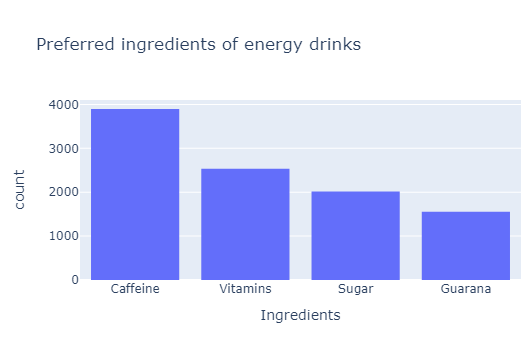
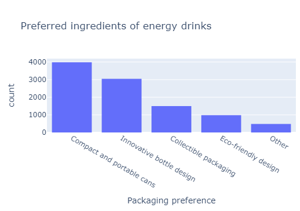
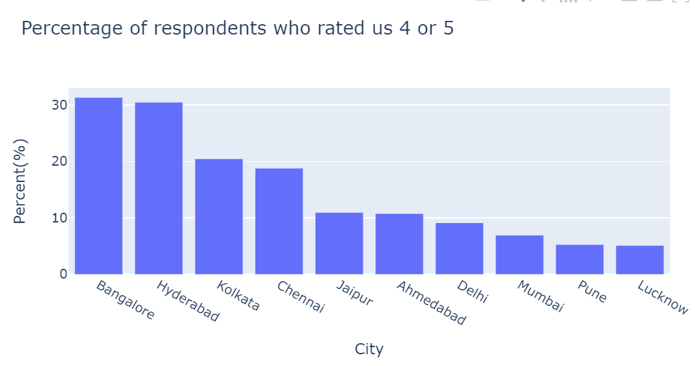
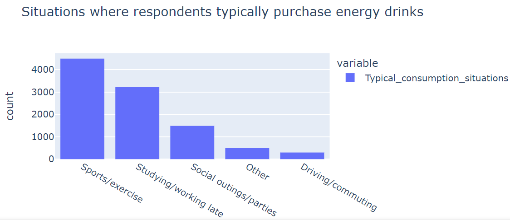
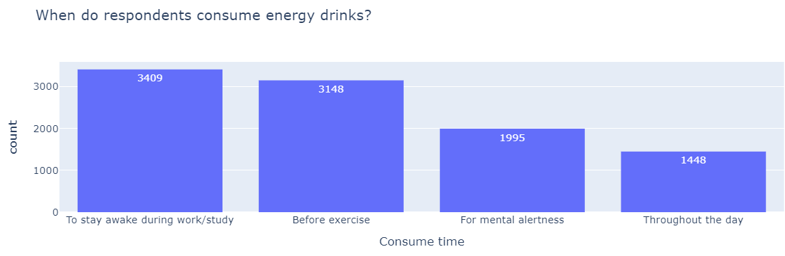

# CodeX Energy drink survey analysis

# Table of Contents

- [Introduction](#introduction)
- [Objective](#objective)
  - [Tools](#tools)
- [Data Exploration](#data-exploration)
- [Data Cleaning](#data-cleaning)
- [Data Analysis](#data-analysis)
  - [Primary Insights](#primary-insights)
  - [Secondary Insights](#secondary-insights)
- [Recommendation](#recommendation)


# Introduction
CodeX is a German beverage company that is aiming to make its mark in the Indian market. A few months ago, they launched their energy drink in 10 cities in India.
Their Marketing team is responsible for increasing brand awareness, market share, and product development. They conducted a [survey](assets/docs/Survey_Questions_and_Response_Options.pdf) in those 10 cities and received results from 10,000 respondents. 

# Objective

- What is the key pain point?

  The Chief Marketing Officer wants to know what meaningful insights can be found in the survey collected and how they can help his team make decisive actions.

- What is the solution?
  
  - I have to answer [questions](assets/docs/Primary_Secondary_Insights.pdf) based on the data given.
  
  - To create a dashboard that provides insights about the survey questions' responses. I will be focusing on:
    1. Marketing channels
    2. Purchase locations
    3. Typical consumption situations
    4. Expected price range of energy drink
    5. Time preferred to consume energy drinks
    6. Number of times energy drinks are consumed


    ## Tools
  
    | Tool | Purpose |
    | --- | --- |
    | Python | Exploring, cleaning, and analyzing the data |
    | Power BI | Visualizing the data via interactive dashboards |
    | GitHub | Hosting the project documentation and version control |

# Data Exploration
- These are my initial observations on the datasets given:
  1. There are no missing data points in all three datasets.
  2. The column **Tried_before** of the [fact_survey_responses.csv](assets/datasets/fact_survey_responses.csv) dataset indicates if the respondents have tried our product or not. There is another column **Taste_experience** that allows respondents to give a rating on our product if they have tried it. It seems some respondents responded No to **Tried_before** while still giving a rating. So that has to be corrected.
  3. The column **Reasons_preventing_trying** of the [fact_survey_responses.csv](assets/datasets/fact_survey_responses.csv) dataset indicates why respondents who answered No to the **Tried_before** column did not try our product. Respondents who answered Yes to the **Tried_before** column should not have responded to the **Reasons_preventing_trying** column. So that has to be corrected.
  4. The column **Brand_perception** of the [fact_survey_responses.csv](assets/datasets/fact_survey_responses.csv) dataset indicates what respondents who answered Yes to the **heard_before** column think of our product. Respondents who answered No to the **Heard_before** column should not have any response in the **Brand_perception** column. This has to be corrected.

# Data Cleaning
- The pandas and the numpy packages in the python programming language will be used to change the values of the columns to expected Null values. These are the conditions:
  
| Condition | Column Name | Expected Value |
| --- | --- | --- |
| **Tried_before** = No | **Taste_experience** | NULL |
| **Tried_before** = Yes | **Reasons_preventing_trying** | NULL |

Below are the codes used to execute the cleaning of data:

```python
not_tried_before = fact_survey_responses['Tried_before'] == 'No'
fact_survey_responses.loc[not_tried_before, 'Taste_experience'] = np.nan
```
```python
tried_before = fact_survey_responses['Tried_before'] == 'Yes'
fact_survey_responses.loc[tried_before, 'Reasons_preventing_trying'] = np.nan
```

# Data Analysis

## Primary Insights
There are various questions provided by the marketing team that we are expected to answer:
* 1\. Demographic Insights
  
   * 1.a\. Who prefers energy drinks more? (male/female/non-binary)
     
     
     
     Looking into gender, **60%** of the respondents are **Male**, about **35%** are **Female** and **5%** are **Non-binary**. More than half of our respondents are male. Therefore males prefer energy drinks. This corresponds with information found [here]([https://typeset.io/questions/is-there-difference-in-energy-drink-consumption-and-gender-2d3ls3206u#:~:text=Energy%20drink%20consumption%20differs%20by,times%20more%20than%20women%201.](https://www.ingentaconnect.com/contentone/psp/hbpr/2022/00000009/00000003/art00006)), that more male take energy drinks than female. It also adds that males buy in more       quantity than females.
     
   * 1.b\. What age group prefers energy drinks more?

     
     
     **19-30** age group purchases our product the most. They account for **55%** of the dataset. Followed by the **31-45** age group which is **24%** and **15-18** age        group which is **15%**. It seems the **65+** age group purchased our product the least. It has to be taken into           
     consideration that the **15-18** age group has smaller bins than the other age ranges. According to the [NIC](https://www.nccih.nih.gov/health/energy-drinks#:~:text=Next%20to%20multivitamins%2C%20energy%20drinks,kinds%20of%20energy%20drink%20products.), Men of the **18-34** age group consume the most energy                  drinks, and almost one-third of teens between **12-17** age group drink them regularly.
     
   * 1.c\. Which type of marketing reaches the most Youth (15-30)? 
       
     
       The best marketing channel for the 19-30 age range is **Online ads** which account for **48%** of the respondents. The next marketing channel is **TV Commercial** which accounts for **25%**. The worst marketing channel is **Print Media** which accounts for **6%**.

* 2\. Consumer Preferences
    * 2.a\. What are the preferred ingredients of energy drinks among respondents?
        

        The top consumer preference is **caffeine** which accounts for **39%** of our respondents, **vitamins** for **25%**, and **sugar** for **20%**. 

    * 2.b\. What packaging preferences do respondents have for energy drinks?
        
 
        The top packaging preference is **Compact and portable cans** which accounts for **40%** of respondents, **Innovative bottle design** accounts for **30%**, **Collectible packaging** accounts for **15%**.

* 3\. Competition Analysis
    * 3.a\. Who are the current market leaders?
      

      The top market leader is **Cola-Coka** which accounts for **25%** of the respondents, **Bepsi** accounts for **21%**, and **Gangster** accounts for **19%**.
    * 3.b\. What are the primary reasons consumers prefer those brands over ours?
      

      The primary reason respondents prefer to consume those brands is **Brand reputation** which accounts for **27%** of the respondents, **Taste/flavor                        preference** accounts for **20%**, and **Availability** accounts for **19%**.

* 4\. Marketing Channels and Brand Awareness
    * 4.a\. Which marketing channel can be used to reach more customers?
      

      The most effective marketing channel is **Online ads** accounting for **40%** of our respondents, **TV commercials** accounting for **27%**, and **Outdoor billboards** accounting for **12%**.
      
    * 4.b\. How effective are different marketing strategies and channels in reaching our customers?
      Our potential customers in this case refer to respondents who either heard or tried our product. I wanted to identify what marketing channels these respondents preferred.
 
      
      
      The top marketing channel is **Online ads** which account for **41%** of respondents who heard about our product. **TV commercials** which account for **28%**.            **Outdoor billboards** which account for **12%**.
 
      
      
      The top marketing channel is **Online ads** which accounts for **42%** of respondents who tried our product. **TV commercials** which account for **20%**. **Other**       which accounts for **15%**.   

      For respondents who heard of or tried our product, **Online** and **TV commercials** are the most effective marketing channels and they should be used.

* 5\. Brand Penetration
    * 5.a\. What do people think about our brand? (overall rating)

      

      Nearly **50%** of the  respondents (**4881**) have tried our product. The distribution of the ratings above shows us that more respondents rated our product 3-5 rating compared to the 1-2 rating. The average rating is 3.3. Generally, as 3 is average, respondents generally think our product is slightly above average.
    
    * 5.b\. Which cities do we need to focus on?

      

      Focusing on cities where all respondents reside, **Bangalore** has the highest number of respondents accounting for **41%** of respondents. Next is **Hyberabad**          accounting for **18%**. Then **Mumbai** accounting for **15%**.

      

      2153 respondents rated our product either 4 or 5. **41%** of which live in **Bangalore**, **26%** in **Hyderabad**, and **13%** in **Chennai**.

      

      Finally, focus was made on the percentage of people who rated our product either 4 or 5 compared to the total number of their corresponding cities. As shown above,        **31%** of respondents from **Bangalore** rated our product a 4 or 5, **30%** from **Hyderabad**, and **20%** from **Kolkata**.

      On the different criteria given, **Bangalore** and **Hyderabad** were at the top. I recommend we focus on these cities mainly. While sales made in the other cities will be closely monitored.

* 6\. Purchase Behaviour
    * 6.a\. Where do respondents prefer to purchase energy drinks?
  
      

      The most preferred location respondents prefer to purchase energy drinks is **Supermarkets** which accounts for **45%** of the respondents. Next is **Online retailers** which accounts for **26%**, and **Gym and fitness centers** which accounts for **15%**.
    
    * 6.b\. What are the typical consumption situations for energy drinks among respondents?
 
      

      The situation that respondents typically consume energy drinks the most is **Sports/exercise** which accounts for **45%** of respondents. Next is **Studying/working** which accounts for **32%** and **Social outings/parties** which accounts for **15%**.

    * 6.c\. What factors influence respondents' purchase decisions, such as price range and limited edition packaging?
      * i. Price range
        
 
        The most preferred price range for respondents is **50-99** which accounts for **43%** of respondents. Next is **100-150** which accounts for **31%** of respondents.
 
        **74%** of respondents preferred the price range between **50-150**.

      * ii. Limited edition packaging
        

        **40%** of the respondents answered **Yes**  and **40%** of the respondents answered **No**. **20%** answered **Not Sure**.
        
        Limited edition packaging involves making unique limited branded products for a brief period of time. Therefore, I recommended that our products should
        have limited edition packaging. **40%** of respondents said **Yes** and limited edition packaging is not targeted to all of our customers.

* 7\. Product Development
  * 7.a\. Which area of business should we focus more on our product development? (Branding/taste/availability)
    
    Before deciding where to focus, it's important to view what respondents think of our product.
    

    **60%** of people had **Neutral** thoughts about our product. **23%** of people had **Positive** thoughts about our product. **17%** of people had **Negative** thoughts about our product.
    Generally, respondents think our products are just okay which aligns with the respondents' average rating of our product of **3.3**.
    
    Next, we focus on what reasons our respondents have for not trying our product.  

    
    
    There are **5119** respondents who have not tried our product. **Health concerns** is the top reason **23%** of these respondents dislike our product. Next is **Not interested in energy drinks** which accounts for 
    **23%**, **Not available locally** which accounts for **23%** and **Unfamiliar with the brand** which accounts **20%**.

    This [publication](https://www.ncbi.nlm.nih.gov/pmc/articles/PMC4682602/) focuses on the benefits and adverse effects of energy drinks.
    __Recommendations__
    - I recommend the company makes healthier versions of our product to fit these needs.
    - I recommend the company increases its advertisements of our product
   
    I also looked into why respondents were choosing other brands.

    
    
    The top reason respondents choose other brands is **Brand reputation** which accounts for **27%** of the respondents. Next is **Taste/flavor preference** which accounts for **20%** and **Availability** which 
    accounts for **19%**.
  
    Also, I looked into what improvements respondents desired.
    
    
    **Reduced sugar content** is the top improvement respondents would like to see in energy drinks which accounts for **30%**. **More natural ingredients** accounts for **25%** and **Wider range of flavors** accounts 
    for **20%**.

    Lastly, I looked into what packaging respondents preferred.
    
    
    Respondents prefer **Compact and portable cans** which account for **40%**. Next is **Innovative bottle design** which accounts for **30%** and **Collectible packaging** which accounts for **15%**.

## Secondary Insights

1. How many times a week do respondents consume energy drinks?
   

   **2-3 times a week** is the top most response which accounts for  **35%** of the respondents. Next is **Rarely** which accounts for **20%**, and **2-3 times a month** which accounts for **16%**.
   
3. When do respondents consume energy drinks?
   

   **To stay awake during work/study** is the top response which accounts for **34%** of respondents. Next is **Before exercise** which accounts for **31%** of respondents, and **For mental alertness** which accounts for **20%** of respondents.  

# Recommendation
1. Our products should be advertised mainly to **19-30 men** as they are our primary customers.
2. **Online Ads** and **TV commercials** should be used for advertisements.
3. I recommend **Bangalore** and **Hyderabad** as cities to focus advertisements in. These cities are where the highest portion of our respondents reside. These cities have the highest number of respondents who rated our product above average.
4. The price of our product should be between **50-150**, as **74%** of respondents preferred these price ranges.
5. I recommend selling our products in **Supermarkets**, **Online retailers**, and **Gym and fitness centers**. These locations account for **86%** of the respondents response as regards location of purchase of energy drinks.
6. **40%** of the respondents said **Yes** to limited edition packaging which is nearly half of our respondents. I recommend we provide these packages with the intention of targeting these customers.
